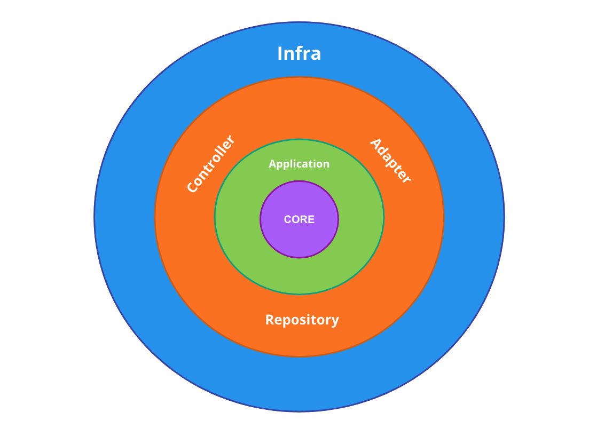

# Email handler


## 💻 Sobre
Este é um projeto em desenvolvimento que envolve a criação de um futuro microsserviço para o envio de e-mails utilizando 
arquitetura limpa, no momento, há apenas o envio de e-mails por requisição de uma URI.

## 🤖 Tecnologias
* [Spring Boot (Web, Mail, Data JPA, Validation, Devtools)](https://docs.spring.io/spring-framework/reference/index.html)
* [Docker](https://docs.docker.com)
* [Maven](https://maven.apache.org)
* [Hibernate](https://hibernate.org)
* [PostgreSQL](https://www.postgresql.org)
* [Lombok](https://projectlombok.org)

## 🚀 Setup
Primeiramente, para que tudo ocorra corretamente, você deverá adicionar algumas variáveis de ambiente ao arquivo
`src/main/resources/application.properties`, sendo essas:
```properties
spring.datasource.url=${DB_URL}
spring.datasource.username=${DB_USERNAME}
spring.datasource.password=${DB_PASSW}

spring.mail.username=${GMAIL_SENDER_USER}
spring.mail.password=${GMAIL_SENDER_PASSW}
```
- DB_URL: Sua URL de conexão no banco de dados, com este formato padrão: `jdbc:postgresql://localhost:15432/seu_database`,
importante salientar que deverá ter criado com antecedência o seu banco de dados, alterando o nome do banco
no campo enviroments do arquivo `docker-compose.yaml`.
- DB_USERNAME: Esta tem o valor de "postgres" que é o username padrão do PostgreSQL, caso queira modificar sinta-se livre
adicionando no campo enviroments de email-postgres no arquivo `docker-compose.yaml`.
- DB_PASSW: Mesma situação de cima para modficações, o valor que está na variável deverá ser a mesma do arquivo do 
`docker-compose.yaml`.
- GMAIL_SENDER_USER: Aqui será informado o e-mail rementente para o envio do que deseja.
- GMAIL_SENDER_PASSW: Neste campo, será passado a senha para apps gerada de 16 digitos e não a senha do seu e-mail,
para mais informações de como cria-lá, acesse este [link](https://support.google.com/accounts/answer/185833).

Caso você não tenha docker instalado ou não saiba utilizar, não será necessário para que a aplicação funcione, basta
baixar o PostgreSQL localmente com o PgAdmin4 e alterar a porta da DB_URL para 5432, e obviamente caso, tenha configurado
nome e senha diferente, fazer as devidas alterações nas variáveis de ambiente.

## 🤔 Como funciona
Rodando a aplicação e seu banco de dados, você irá enviar uma requisição do tipo POST neste endpoint: `localhost:8080/email-service/send` com o seguinte
formato de requisição JSON:
```json
{
  "ownerRef": "Crystian",
  "emailTo": "******@gmail.com",
  "subject": "Título do e-mail",
  "body": "Corpo do e-mail"
}
```
- ownerRef: Este campo é referente por enquanto ao nome de quem está enviando o e-mail, somente para controle.
- emailTo: Aqui será colocado para quem você deseja enviar este e-mail, seu destinatário.
- subject: Como já implica no exemplo, é o título do e-mail, o assunto.
- body: Assim como no exemplo já diz, este é o campo do corpo do e-mail que será enviado.

Com o envio deste requisição, primeiro o e-mail será montado e enviado através do SMTP(Simple Mail Transfer Protocol) 
do Gmail, por fim, será salvo na tabela tb_email, com sucesso ou não.

### 🏛 Arquitetura
A arquitetura usada no projeto é a Clean Architecture e ela tem este formato:

- Core: Pasta onde é encontrado a entidade, neste caso, o e-mail, também tem seus casos de uso, ou regras de negócio.
- Application: Neste diretório é onde é montado os serviços com base nos casos de uso da entidade, neste caso, lá
poderá ser encontrado o `EmailService` que implementa os métodos assinados na interface de regra de negócio `EmailUseCase`.
- Controller: Camada que aplicará o serviço de e-mail e a depender da rota acessada e método HTTP executará uma ação.
- Adapter: Diretório que fornece interfaces para que tudo que chegar de infra seja adaptado para funcionar na camada da
aplicação.
- Repository: Parte onde fornecerá uma interface que conectará ao banco de dados e entregar os métodos para a camada de
aplicação.
- Infra: Por último temos a camada de infraestrutura, nela teremos todo código externo a aplicação somente tendo que se conectar
através da camada de Adapter, como exemplo, temos o nosso serviço de envio de e-mail externo, sendo assim, se eu quiser
modificar para Amazon SES, basta que eu crie a classe e implemente a interface e seus métodos necessários para a conexão
com a aplicação.

## 📝 Referencias

Links de refência para a criação do projeto:

[Desafio UBER](https://github.com/uber-archive/coding-challenge-tools/blob/master/coding_challenge.md),
[Fernanda Kipper](https://github.com/Fernanda-Kipper/desafio-backend-uber/tree/main),
[Michelli Brito](https://github.com/MichelliBrito/microservices-na-pratica/tree/main).
